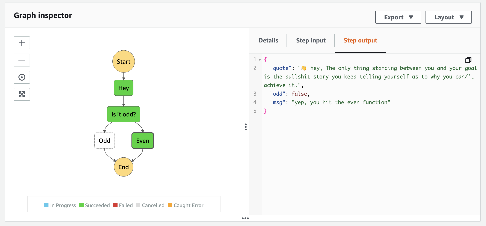

# 🕰️ Day 03

## 🦾 I am a state machine 🦿

### 🔧 Recap & Restructure

make a `ts` folder to handle the typescript build and test. And it will be easier to add more typescript functions/lambdas later. 
```
$ tree -I node_modules
.
├── samconfig.toml
├── template.yaml
└── ts
    ├── babel.config.js
    ├── build
    │   └── src
    │       ├── hey.js
    │       └── package.json
    ├── package-lock.json
    ├── package.json
    ├── src
    │   └── hey.ts
    ├── test
    │   ├── integration
    │   │   └── handler.integration.test.ts
    │   └── unit
    │       └── test-handler.test.ts
    └── tsconfig.json

```
N.B. make sure the `package.json` is included in the build location (`ts/build/src`) before `sam build`


### 📖 Background readings:
- [What is AWS Step Functions?](https://docs.aws.amazon.com/step-functions/latest/dg/welcome.html)
- [Tutorials for Step Functions](https://docs.aws.amazon.com/step-functions/latest/dg/tutorials.html)

Très bien! Let's start with a simple step functions:


So the idea is to build a step function with api and lambdas. Once the api endpoint is triggered, it will generate a random quote, then the random quote will be passed to state machine choice step. If the length of quote is odd, the odd function will add a message to the reponse. If the length of the quote is even, the even function will add message to it as well. 


### ⚙️ lambda functions ⚙️

- ⚙️ `hey` lambda: Once it is triggered, it will return a random quote and variable `$.odd` to state if the quote is odd or even
- ⚙️ `odd` lambda: It will append the odd message to reponse
- ⚙️ `even` lambda: It will append the even message to reponse

####  ⚙️ `hey` lambda
Let's mute `APIGatewayProxyEvent` and `APIGatewayProxyResult` from `aws-lambda`. For this step functions, this will be custom lambda integration instead. 
```
/*
import { 
    APIGatewayProxyEvent, 
    APIGatewayProxyResult
} from "aws-lambda";
--> it is no longer lambda proxy integration, it is custom lambda integration
*/
```
Update the `hey.ts`:
```
import "popular-movie-quotes";

export const lambdaHandler = async () => {
    const movieQuote = require("popular-movie-quotes");
    console.log(movieQuote.getRandomQuote());
    let quote = movieQuote.getRandomQuote()
    if (quote.length % 2 == 0 ){
        return {
            quote: `👋 hey, ${quote}`,
            odd : false,
        }
    }else{
        return {
            quote: `👋 hey, ${quote}`,
            odd : true,
        }
    }
}
```

####  ⚙️ `odd` lambda:
- Add `odd.ts`:
```
export const lambdaHandler = async (event: any, context: any) => {
    return {
        quote: event["quote"],
        odd : event["odd"],
        msg : "yep, you hit the odd function"
    }
}

```

####  ⚙️ `even` lambda:
- Add `even.ts`:
```
export const lambdaHandler = async (event: any, context: any) => {
    return {
        quote: event["quote"],
        odd : event["odd"],
        msg : "yep, you hit the even function"
    }
}
```

### 🦾 Add state machine 🦿
- ✍🏻 add statemachine flow:
```
$ mkdir -p statemachine
$ touch statemachine/transaction_flow.asl.json
```
transaction_flow.asl.json:
```
{
    "Comment": "hey state machine demo",
    "StartAt": "Hey",
    "States": {
        "Hey": {
            "Type": "Task",
            "Resource": "${HeyFunctionArn}",
            "Retry": [
                {
                    "ErrorEquals": [
                        "States.TaskFailed"
                    ],
                    "IntervalSeconds": 15,
                    "MaxAttempts": 1,
                    "BackoffRate": 1.5
                }
            ],
            "Next": "Is it odd?"
        },
        "Is it odd?": {
            "Type": "Choice",
            "Choices": [
                {
                    "Variable": "$.odd",
                    "BooleanEquals": true,
                    "Next": "Odd"
                }
            ],
            "Default": "Even"

        },
         "Odd": {
            "Type": "Task",
            "Resource": "${OddFunctionArn}",
            "Retry": [
                {
                    "ErrorEquals": [
                        "States.TaskFailed"
                    ],
                    "IntervalSeconds": 15,
                    "MaxAttempts": 1,
                    "BackoffRate": 1.5
                }
            ],
            "End": true
        },
        "Even":{
            "Type": "Task",
            "Resource": "${EvenFunctionArn}",
            "Retry": [
                {
                    "ErrorEquals": [
                        "States.TaskFailed"
                    ],
                    "IntervalSeconds": 15,
                    "MaxAttempts": 1,
                    "BackoffRate": 1.5
                }
            ],
            "End": true
        }
    }
    
}
```

- 🛠️ Update `template.yaml`:
```
AWSTemplateFormatVersion: '2010-09-09'
Transform: AWS::Serverless-2016-10-31
Description: >
  hello-world step functions
  
# More info about Globals: https://github.com/awslabs/serverless-application-model/blob/master/docs/globals.rst
Globals:
  Function:
    Timeout: 3

Resources:
  HeyApi:
    Type: AWS::Serverless::Api
    Properties:
        StageName: dev

  Hey:
    Type: AWS::Serverless::Function
    Properties:
      CodeUri: ts/build/src/
      Handler: hey.lambdaHandler
      Runtime: nodejs14.x
      MemorySize: 128
      Policies:
        - AWSLambdaBasicExecutionRole
  
  Odd:
    Type: AWS::Serverless::Function
    Properties:
      CodeUri: ts/build/src/
      Handler: odd.lambdaHandler
      Runtime: nodejs14.x
      MemorySize: 128
      Timeout: 3
      Policies:
        - AWSLambdaBasicExecutionRole
  
  Even:
    Type: AWS::Serverless::Function
    Properties:
      CodeUri: ts/build/src/
      Handler: even.lambdaHandler
      Runtime: nodejs14.x
      MemorySize: 128
      Timeout: 3
      Policies:
        - AWSLambdaBasicExecutionRole

  HeyFlowStateMachine:
    Type: AWS::Serverless::StateMachine # More info about State Machine Resource: https://docs.aws.amazon.com/serverless-application-model/latest/developerguide/sam-resource-statemachine.html
    Properties:
      DefinitionUri: statemachine/transaction_flow.asl.json
      DefinitionSubstitutions:
        HeyFunctionArn: !GetAtt Hey.Arn
        OddFunctionArn: !GetAtt Odd.Arn
        EvenFunctionArn: !GetAtt Even.Arn
      Events:
        ApiEvent:
          Type: Api # More info about Schedule Event Source: https://docs.aws.amazon.com/serverless-application-model/latest/developerguide/sam-property-statemachine-schedule.html
          Properties:
            Path: /poke
            Method: get
            RestApiId:
                Ref: HeyApi
      Policies: # Find out more about SAM policy templates: https://docs.aws.amazon.com/serverless-application-model/latest/developerguide/serverless-policy-templates.html
        - LambdaInvokePolicy:
            FunctionName: !Ref Hey
        - LambdaInvokePolicy:
            FunctionName: !Ref Odd
        - LambdaInvokePolicy:
            FunctionName: !Ref Even
```

### 👷 All set, Let's build
- 📁 folder structure:
```
.
├── samconfig.toml
├── statemachine
│   └── transaction_flow.asl.json
├── template.yaml
└── ts
    ├── babel.config.js
    ├── package-lock.json
    ├── package.json
    ├── src
    │   ├── even.ts
    │   ├── hey.ts
    │   └── odd.ts
    ├── test
    │   ├── integration
    │   │   └── handler.integration.test.ts
    │   └── unit
    │       └── test-handler.test.ts
    └── tsconfig.json
```

- 🕹️ Let's build:
```
$ cd ts/
$ tsc
$ cd ..
$ sam build 
Building codeuri: ts/build/src/ runtime: nodejs14.x metadata: {} functions: ['Hey', 'Odd', 'Even']
Running NodejsNpmBuilder:NpmPack
Running NodejsNpmBuilder:CopyNpmrc
Running NodejsNpmBuilder:CopySource
Running NodejsNpmBuilder:NpmInstall
Running NodejsNpmBuilder:CleanUpNpmrc

Build Succeeded

Built Artifacts  : .aws-sam/build
Built Template   : .aws-sam/build/template.yaml

Commands you can use next
=========================
[*] Invoke Function: sam local invoke
[*] Deploy: sam deploy --guided

$ sam local invoke Hey
Invoking hey.lambdaHandler (nodejs14.x)
Skip pulling image and use local one: amazon/aws-sam-cli-emulation-image-nodejs14.x:rapid-1.18.1.

Mounting /Users/pingzhou.liu/Documents/TS_test/serverless-ts-log/playground/.aws-sam/build/Hey as /var/task:ro,delegated inside runtime container
START RequestId: 46570e72-64a1-40ac-8955-a4ce68cdd9ea Version: $LATEST
2021-02-21T21:54:26.675Z        46570e72-64a1-40ac-8955-a4ce68cdd9ea    INFO    Keep your friends close, but your enemies closer.
END RequestId: 46570e72-64a1-40ac-8955-a4ce68cdd9ea
REPORT RequestId: 46570e72-64a1-40ac-8955-a4ce68cdd9ea  Init Duration: 0.31 ms  Duration: 152.08 ms     Billed Duration: 200 ms Memory Size: 128 MBMax Memory Used: 128 MB
{"quote":"👋 hey, Do, or do not. There is no 'try'.","odd":true}

$ sam deploy
```
- 🎡 okie dokie, let's trigger the step functions



<p align="center">
  
</p>

[🏠 back to homepage](https://github.com/applegreengrape/serverless-ts-log)