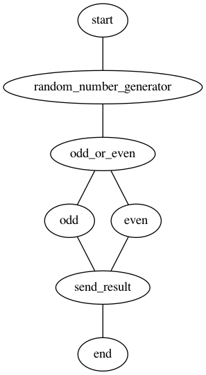

# 🕰️ Day 03

## 🦾 I am a state machine 🦿

Background readings:
- [What is AWS Step Functions?](https://docs.aws.amazon.com/step-functions/latest/dg/welcome.html)
- [Tutorials for Step Functions](https://docs.aws.amazon.com/step-functions/latest/dg/tutorials.html)

Très bien! Let's start with a super simple step functions:
